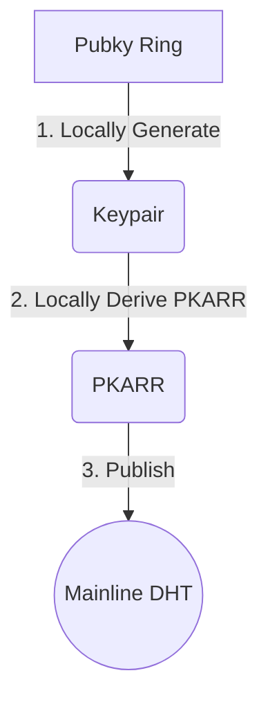
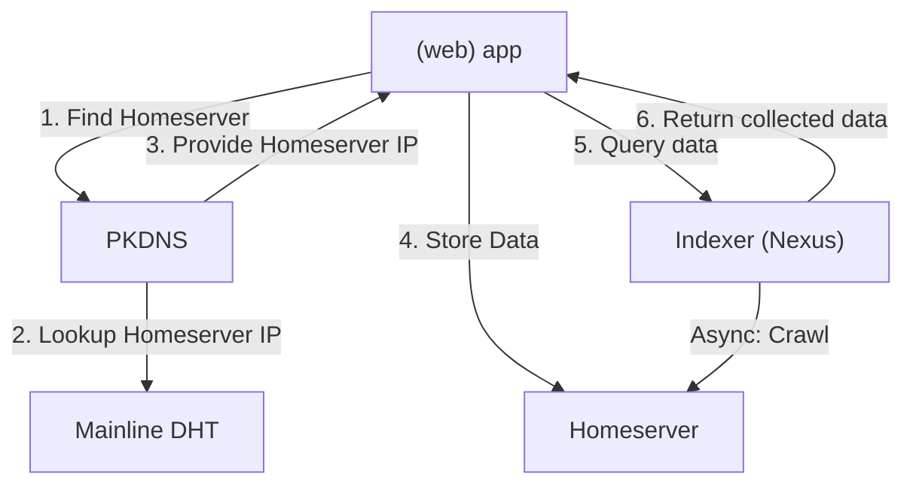

# 🏗️ pubkytecture

**Visualize the invisible. Follow the traces of a distributed system.**

`pubkytecture` is a developer-focused learning tool designed to deconstruct and animate the inner workings of the [Pubky Core](https://pubky.org/) ecosystem. While most users only see the interface of a web app, `pubkytecture` provides a "glass-box" view of the entire Pubky Core lifecycle — from key generation over publishing content to global indexing.

## 🚀 Start Exploring

**👉 [Launch Pubkytecture](https://gcomte.github.io/pubkytecture/) 👈**

Interactive visualization of the Pubky architecture.

<!-- GitHub Pages URL pattern: https://<username>.github.io/<repository-name>/ -->
<!-- Update URL if repository is moved/forked -->

---

powered by [`@synonymdev/pubky`](https://www.npmjs.com/package/@synonymdev/pubky)

---

## 🧐 What is this?

Distributed architectures are often hard to grasp because the data flow is non-linear. `pubkytecture` acts as a **visual tracer**. When you perform an action (like posting a picture), the tool halts at every architectural layer, showing you exactly what is happening under the hood:

1.  **Identity Layer:** Keypair generation and registration onto Mainline DHT.
2.  **Discovery Layer:** Mainline DHT lookups over PKDNS.
3.  **Storage Layer:** Publishing data to homeserver.
4.  **Indexing Layer:** Nexus crawling homeserver.

For each step pubkeytecture furthermore explains, why given architecture is beneficial, highlighting concepts like [Credible Exit](https://newsletter.squishy.computer/p/credible-exit).

---

## 🚀 Key Simulations

### 1. Identity Birth (Account Creation)
Witness how a user becomes a sovereign entity on the web.
*   **Key Gen:** Generating Ed25519 pairs.
*   **PKDNS:** Publishing the public key to the **Mainline DHT**, making your "handle" resolvable globally.

### 2. The Journey of a Post on Pubky.app
Follow a single piece of content from a user's click to the global feed:
*   **Resolution:** The app performs a DHT lookup to find the user's current **Homeserver**.
*   **Transmission:** Data is signed and pushed to the Homeserver via Pubky Core.
*   **Indexing:** The **Nexus** (indexer) detects the new content on the homeserver and parses it.
*   **Retrieval:** The frontend queries the Nexus to display the post in a structured social feed.

---

## 🛠️ Tech Stack

- **Build:** Vite + React + TypeScript
- **Styling:** Tailwind CSS (dark mode only)
- **Diagrams:** React Flow (@xyflow/react)
- **Animations:** Framer Motion
- **Pubky Protocol:** `@synonymdev/pubky`
- **Testing:** Vitest + Playwright
- **Deployment:** GitHub Pages (static SPA)

---

## 🏗️ Architecture Overview

The visualization maps the following flows:

### Identity birth



### Data storage



---

## 🚦 Getting Started

### Prerequisites
- Node.js (v18+)
- A basic understanding of Decentralized Identifiers (DIDs)

### Installation

```bash
# Clone the repository
git clone https://github.com/gcomte/pubkytecture.git

# Navigate to directory
cd pubkytecture

# Install dependencies
npm install
```

### Run the Simulator

```bash
npm run dev
```

### Development

```bash
# Run unit tests
npm run test

# Run E2E tests (when implemented)
npm run test:e2e

# Build for production
npm run build
```

---

## 📖 Educational Goals

This tool is designed to answer common developer questions:
- *How does the app know which server my data is on?* (Answer: DHT/PKDNS)
- *Is my data instantly searchable?* (Answer: Only after the Nexus indexes it)
- *How can someone change his homeserver?* (Answer: Needs to send updated PKARR to Mainline DHT)

## 🤝 Contributing

We welcome contributions that add more "steps" to the visualization (e.g., following, re-pubkying, or binary data handling). 

1. Fork the repo.
2. Create your feature branch.
3. Submit a PR.

## 📄 License

MIT

---
*Created for the Pubky developer community.*
